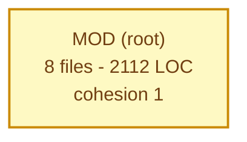
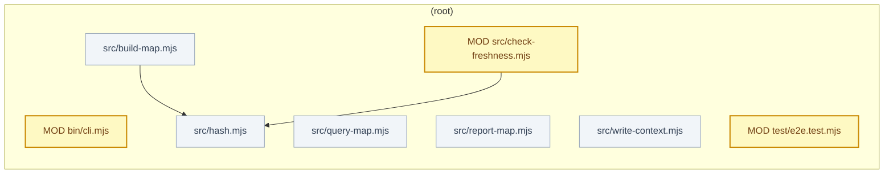

# Codebase map

Generated 2026-08-17T14:31:41.183Z from commit `a9537c6` on `master`.
Last commit: v0.1.0

> Compared against `git HEAD:.codemap/snapshot.json` (commit `eb4694c`).

## At a glance

| Metric | Now | Before | Delta |
|---|---:|---:|---:|
| Source files | 8 | 8 | 0 |
| Test files | 1 | 1 | 0 |
| Lines of code | 2112 | 2112 | 0 |
| Internal imports | 2 | 2 | 0 |
| Modules | 1 | 1 | 0 |
| Entry points | 7 | 7 | 0 |
| External packages | 1 | 1 | 0 |

## What changed in this commit

**New files (0)**

_none_

**Modified files (3)**

- `bin/cli.mjs` — 0 LOC
- `src/check-freshness.mjs` — 0 LOC
- `test/e2e.test.mjs` — 0 LOC

**Deleted files (0)**

_none_

**New module boundaries crossed (0)**

_none_

## Module map

Green is new in this commit, yellow was modified, dashed red was deleted. Thick arrows are dependency edges that did not exist before.

## File map for changed modules

## Modules

Cohesion is the share of a module's outbound imports that stay inside the module. Low cohesion means the module leans on the rest of the app and is a poor candidate for extraction as it stands.

| Module | Files | LOC | Exports | Cohesion | In | Out |
|---|---:|---:|---:|---:|---:|---:|
| `(root)` *(changed)* | 8 | 2112 | 8 | 1 | 0 | 0 |

## Excess and dead weight

### Unreachable files (0)

Not reachable from any detected entry point, including tests. Strong deletion candidates, but confirm the entry point list first.

_none_

### Reachable only from tests (0)

Product code that nothing in production imports. Usually a feature that got backed out and left its tests behind.

_none_

### Oversized files (0)

_none_

### Import cycles (0)

_none_

### Identical files (0 groups)

_none_

### Commented out code (0 files)

_none_

### Low cohesion modules (0)

_none_

### Hub files (0)

High fan in. Changing these has wide blast radius, so they need the most test coverage before any refactor.

_none_

## Dependency hygiene

**Declared but never imported (0)**

_none_

**Imported but not declared (1)**

- `);
    assert.ok(!s.edges.some((e) => e.to` — used in 1 files

**Runtime deps only used by tests (0)**

_none_

**Unresolved imports (1)**

- `test/e2e.test.mjs` imports `./does-not-exist` which did not resolve

## Repo hygiene

**Junk files (0)**

_none_

**Large files (0)**

_none_

## Regression check

| Finding | Now | Before | Introduced | Resolved |
|---|---:|---:|---:|---:|
| orphans | 0 | 0 | 0 | 0 |
| testOnly | 0 | 0 | 0 | 0 |
| cycles | 0 | 0 | 0 | 0 |
| unresolved | 1 | 1 | 0 | 0 |
| unusedDeps | 0 | 0 | 0 | 0 |
| undeclaredDeps | 1 | 1 | 0 | 0 |
| depsOnlyUsedInTests | 0 | 0 | 0 | 0 |
| junkFiles | 0 | 0 | 0 | 0 |
| identicalFiles | 0 | 0 | 0 | 0 |

No new findings introduced by this commit.

---

Regenerate with `node scripts/build-map.mjs && node scripts/report-map.mjs`. Commit `.codemap/snapshot.json` together with your code so the next run has something to diff against.
